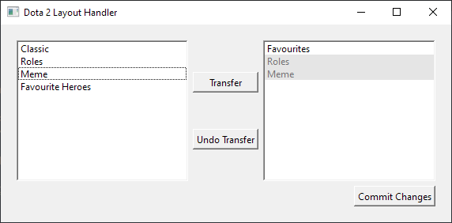

# Dota 2 Layout Handler
An easy way to transfer Dota 2 Layouts (post 2019 Summer Scrub update)

The default location of the layout file should be\
Windows: `C:/Program Files/Steam/userdata/*YOURUSERID*/570/remote/cfg/hero_grid_config.json`\
Linux: `$HOME/.local/share/Steam/userdata/*YOURUSERID*/570/remote/cfg/hero_grid_config.json`

Program will automatically backup files prior to modifications

# Building
Project is built using CMake and currently requires Qt6 to be linked manually.\
This can be done by modifying `QT6_INSTALL_PATH` in CMakeLists.txt, or any other CMake supported way

jsoncpp will automatically be downloaded and linked by HunterGate and CMake.

# Warning
May be messy and still have bugs. The program does create backups so if errors occur, your configs should be safe.